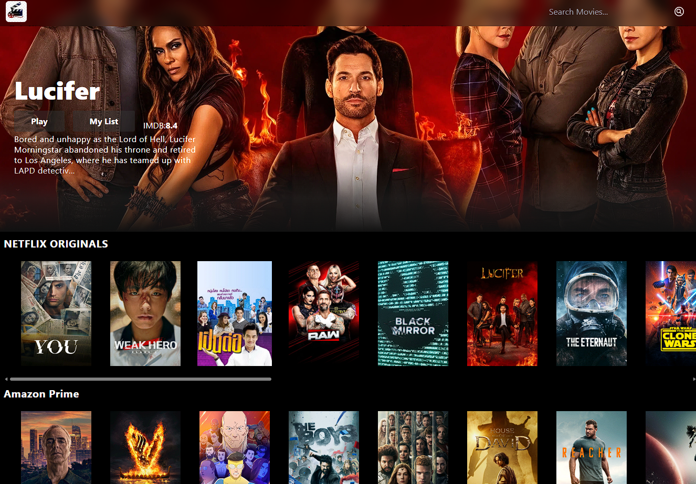

# 🎬 MovieHub (WIP)

A simple React project that uses the TMDB API to display trending movies across major streaming platforms and lets users watch trailers via YouTube. Built just for fun and practice!

---

## 🚀 Tech Stack

- **React** — Frontend framework
- **Axios** — For handling API requests
- **TMDB API** — Movie data source
- **React-YouTube** — Embed and play trailers
- **Tailwind CSS** — For styling and layout

---

## ✅ Current Features

- 🔥 View trending movies across popular streaming platforms (like Netflix, Disney+, etc.)
- 📽 Watch trailers directly from YouTube
- 💅 Smooth, scrollable UI using Tailwind and custom scrollbar styles

---

## 🛠 Next Steps

This project is still in progress. Here’s what’s coming next:

- 🔎 **Search functionality** to look up any movie or TV show
- 📍 Show **where to watch** each movie (streaming availability)
- 🧾 Display detailed **movie and series info**
- ⭐️ For TV shows: show **episode lists with individual ratings**

---

## 📸 Preview



---

1. **Clone the repository**

   ```bash
   git clone https://github.com/AliSepar/Movie-react-website.git

   ```

2. Navigate into the project folder
   ```bash
   cd Movie-react-website
   ```
3. Install dependencies

   ```bash
   npm install
   ```

4. Run the development server

   ```bash
   npm start
   ```
